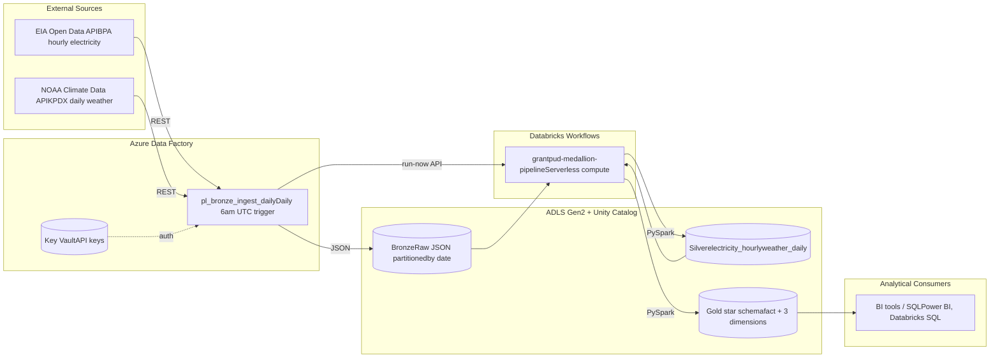
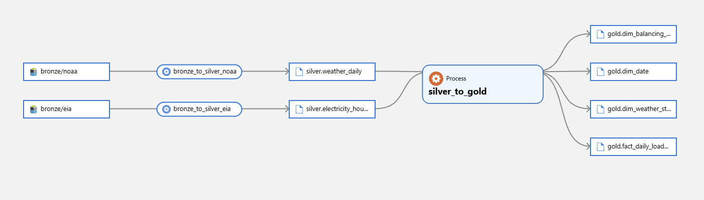

# Grant PUD Proof of Concept

An Azure data engineering portfolio piece demonstrating an end-to-end medallion architecture for ingesting and analyzing public utility load and weather data. Built around the Bonneville Power Administration (BPA) balancing authority and Pacific Northwest weather observations.

## What this project does

The pipeline ingests two public REST APIs into Azure Data Lake Storage Gen2, transforms the raw payloads into curated Delta tables using PySpark on Databricks, and produces a dimensional star schema suitable for analytical consumption. A daily Azure Data Factory trigger drives the bronze layer; a Databricks Workflows job handles silver and gold transformations downstream.

Data sources are deliberately utility-relevant: EIA Open Data API for hourly electricity demand, generation, forecast, and interchange data, paired with NOAA Climate Data Online for daily weather observations from Portland International Airport, the standard reference station for the BPA service area.

## Architecture

The pipeline implements medallion architecture on Delta Lake, a cloud-based data lake pattern that progresses raw external data through curated and analytical layers with increasing levels of trust and schema enforcement at each step.



Bronze is faithful to the source. Silver enforces schema and applies type conversion, deduplication, and validation. Gold contains a star schema with one fact table and three dimensions, including a Type 2 slowly-changing dimension on the balancing authority entity.

## Tech stack

- Azure Data Factory (ingestion orchestration, Git-integrated)
- Azure Databricks Premium (PySpark transformations, Unity Catalog)
- Delta Lake (storage format for all silver and gold tables)
- Azure Data Lake Storage Gen2 (bronze/silver/gold containers)
- Microsoft Purview (catalog and lineage)
- Azure Key Vault (API key storage)
- Azure Managed Identity and RBAC (zero stored credentials in pipelines)
- .NET 8 (monitoring service consuming Event Grid pipeline events)
- Azure SQL Database (pipeline run metadata)
- GitHub Actions (CI/CD for ADF, notebooks, and the .NET service)

## Repository structure
```
grant-pud-poc/
├── adf/                   ADF resources as JSON, auto-committed via Git integration
│   ├── linkedServices/
│   ├── datasets/
│   ├── pipelines/
│   └── triggers/
├── notebooks/             Databricks notebooks in source format
│   ├── bronze_to_silver_eia.py
│   ├── bronze_to_silver_noaa.py
│   └── silver_to_gold.py
├── src/                   .NET 8 monitoring service
│   ├── PipelineMonitor.Worker/    Event Grid consumer
│   ├── PipelineMonitor.Api/       Dashboard API
│   └── PipelineMonitor.Tests/
├── infra/                 IaC templates (Bicep)
├── docs/                  Architecture, runbook, data dictionary
└── .github/workflows/     CI/CD pipelines
```

## Data sources

| Source | Endpoint | Auth | Cadence |
|--------|----------|------|---------|
| EIA Open Data API v2 | `/v2/electricity/rto/region-data/data/` | API key (query param) | Hourly |
| NOAA Climate Data Online v2 | `/cdo-web/api/v2/data` | Token (HTTP header) | Daily |

Both APIs are free and require registration. Keys are stored in Azure Key Vault and fetched by ADF at runtime via the system-assigned managed identity.

## Pipelines

**`pl_bronze_ingest_daily`**: Production pipeline. Pulls one day of EIA and NOAA data, lands JSON in `bronze/` partitioned by date, then invokes the Databricks medallion job via the Jobs API. Runs daily at 06:00 UTC via a Schedule trigger; `runDate` defaults to the trigger's scheduled date minus one (sources publish with a one-day lag).

**`pl_bronze_backfill`**: One-time historical loader. Generates a date array from `startDate` and `daysToGet`, then iterates `pl_bronze_ingest_daily` over each date sequentially. Used to populate historical data without waiting for the daily trigger.

**Databricks Job `grantpud-medallion-pipeline`**: Three-task DAG: `bronze_to_silver_eia` and `bronze_to_silver_noaa` run in parallel, then `silver_to_gold` runs after both complete. Triggered by ADF; runs on serverless compute.

## Star schema

The gold layer follows Kimball dimensional modeling.

**Fact**

| Table | Grain | Measures |
|-------|-------|----------|
| `fact_daily_load_weather` | One row per (date, balancing_authority) | Demand (total/peak/avg MWh), generation, interchange, forecast, temperature (max/min/range), precipitation, wind |

**Dimensions**

| Table | Type | Notes |
|-------|------|-------|
| `dim_date` | Type 1 | Calendar dimension, computed deterministically from fact date range |
| `dim_balancing_authority` | Type 2 (SCD2) | Tracks attribute history; `effective_from`, `effective_to`, `is_current` |
| `dim_weather_station` | Type 1 | Station metadata seeded from a reference table |

The SCD2 implementation uses Delta `MERGE INTO` semantics with `whenMatchedUpdate` to close current rows and `whenNotMatchedInsert` to add new versions, ensuring idempotent reruns.

## Data quality

Each silver notebook executes explicit data validation rules and schema checks before writing, formalizing the data quality expectations for the layer:

- Schema enforcement against an explicit StructType definition
- Null checks on primary key columns
- Duplicate detection on natural keys
- Domain checks where applicable (expected enum values, unit consistency)
- Row count assertions

Failures raise exceptions that propagate through Databricks Workflows and surface as job-level failures, where retry and alerting policies live.

## Monitoring

The pipeline supports both scheduled and event-driven monitoring patterns. Scheduled runs surface in ADF's Monitor view and the Databricks Workflows UI, each providing run history, duration metrics, and failure diagnostics. Event-driven monitoring is implemented via Azure Event Grid: ADF pipeline events flow to a .NET 8 consumer service that persists run metadata to Azure SQL and surfaces a real-time pipeline health dashboard.

Failure escalation and incident documentation are described in `docs/runbook.md`.

## Security model

All Azure-to-Azure authentication uses managed identities and RBAC. No connection strings, account keys, or service principal secrets appear in pipeline or notebook code. The credential layer:

- ADF authenticates to ADLS Gen2 via its system-assigned managed identity (Storage Blob Data Contributor)
- ADF authenticates to Key Vault via its system-assigned managed identity (Key Vault Secrets User)
- Databricks authenticates to ADLS Gen2 via a dedicated Access Connector with its own managed identity, surfaced through Unity Catalog as an external location and storage credential
- The .NET monitoring service authenticates to Azure SQL via its App Service managed identity using Entra ID authentication

The EIA API echoes the caller's API key in every response payload as a documented part of its response contract. The key is a free, read-only credential against public data with no associated authorization beyond rate limiting. The bronze layer retains the response faithfully, including this echo, as is appropriate for a raw layer. The silver bronze-to-silver transformation explicitly drops the `request` object, ensuring the credential does not propagate to consumer-facing layers. For credentials with material risk such as PHI feeds or write-capable tokens, the appropriate pattern would be a network-boundary scrub before bronze; the architecture supports adding that layer cleanly.

## Catalog and lineage

Unity Catalog provides the active catalog backbone for the data lake. Tables in `grantpud.silver`, `grantpud.gold`, and `grantpud.observability` are discoverable through the Catalog UI and queryable via standard SQL.

Microsoft Purview is configured to scan the ADLS Gen2 storage account and the Databricks workspace, with lineage relationships across the medallion architecture captured as Atlas Process entities linking sources, transformations, and consumers. The diagram below shows the complete pipeline from raw bronze JSON through silver Delta tables into the gold star schema.



## CI/CD

Each system uses the deployment pattern most appropriate to its runtime:

- **.NET monitoring service**: GitHub Actions builds, tests, and deploys via OIDC federation to App Service on every push to `main`. Workflow lives in `.github/workflows/main_app-grantpud-poc-monitor.yml`.
- **Azure Data Factory**: Native Git integration commits all resources to `main` under `/adf`. The Publish action in ADF Studio promotes the JSON to the `adf_publish` branch, which serves as the deployment artifact. Multi-environment promotion would use this branch as input to an ARM deployment workflow.
- **Databricks notebooks**: Databricks Repos integration syncs notebook source to GitHub, with the workspace reading directly from the Repos folder. Multi-environment promotion would use the Databricks CLI to sync between workspaces.

The current setup supports a single-environment PoC. The architecture is ready to extend to multi-environment promotion when needed.

## Status

Complete:

- Azure infrastructure provisioned (storage, ADF, Databricks, Key Vault, SQL, App Service, Access Connector)
- Unity Catalog with external locations and three-tier schema (`grantpud.silver`, `grantpud.gold`)
- ADF bronze ingestion pipeline with daily trigger and managed identity authentication
- Historical backfill pipeline with parameterized date range
- Silver layer for both NOAA and EIA with schema enforcement and data quality checks
- Gold star schema with SCD2 dimension and idempotent MERGE writes
- End-to-end ADF-to-Databricks orchestration

In progress:

- .NET 8 monitoring service consuming ADF Event Grid events
- CI/CD workflows (currently scaffolded as stubs)
- Microsoft Purview scan and lineage diagram
- Documented runbook for failure modes
- Flat-file ingestion path (reference data via CSV)

## Local setup

Reproducing this project requires an Azure subscription and the Azure CLI, .NET 8 SDK, and Databricks CLI. Full setup details are in `docs/architecture.md`.

## License

MIT. See `LICENSE`.