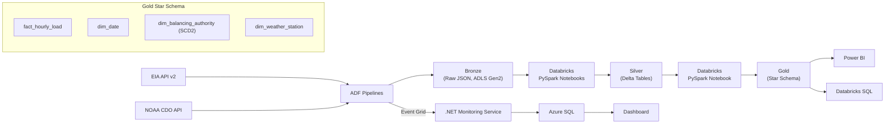

# Grant PUD PoC

Azure data engineering PoC ingesting public utility load and weather data into a medallion architecture for analytical consumption.

## Why This Project Exists

This is a portfolio piece demonstrating end-to-end Azure data engineering patterns using publicly available energy and weather data. The project ingests Bonneville Power Administration (BPA) balancing authority load data from the EIA and correlates it with NOAA weather observations from Portland International Airport. It exercises ADF orchestration, Databricks PySpark transformations, Delta Lake storage, dimensional modeling (including SCD2), .NET-based pipeline monitoring, and CI/CD via GitHub Actions. The architecture mirrors patterns common in utility and energy sector data platforms, where load forecasting and weather correlation are standard analytical workloads.

## Architecture

Data flows through a bronze/silver/gold medallion architecture. Raw JSON lands in the bronze layer via ADF pipelines, PySpark notebooks in Databricks clean and conform it into silver Delta tables, and a final notebook builds a star schema in the gold layer for analytical consumption.



## Tech Stack

- Azure Data Factory
- Azure Databricks (Premium tier)
- Delta Lake
- Azure Data Lake Storage Gen2
- Unity Catalog
- Microsoft Purview
- .NET 8
- Azure SQL Database
- Azure Event Grid
- GitHub Actions

## Data Sources

### EIA Open Data API v2

The [EIA Open Data API](https://www.eia.gov/opendata/) provides hourly demand, generation, and interchange data for the BPAT (Bonneville Power Administration) balancing authority. This data forms the core fact table in the gold layer.

### NOAA Climate Data Online API

The [NOAA CDO API](https://www.ncdc.noaa.gov/cdo-web/) provides hourly weather observations from station GHCND:USW00024229 (Portland International Airport). PDX is the standard reference station for the BPA service area and is used here for weather correlation against load data.

Both APIs require free registration for API keys. In this implementation, keys are stored in Azure Key Vault and referenced by ADF linked services.

## Repository Structure

```
grant-pud-poc/
├── docs/           Documentation: architecture, runbook, data dictionary
├── adf/            Azure Data Factory resource definitions (JSON exports)
├── notebooks/      Databricks notebooks (.py source format)
├── src/            .NET 8 monitoring service (Worker + API + Tests)
├── infra/          Infrastructure-as-code (Bicep/ARM templates)
└── .github/        GitHub Actions CI/CD workflows
```

## Setup Prerequisites

To reproduce this project you will need:

- Azure subscription with permissions to create resource groups
- Azure CLI (2.50+)
- Databricks CLI (0.200+)
- .NET 8 SDK
- GitHub account
- EIA API key (free registration at https://www.eia.gov/opendata/)
- NOAA CDO token (free registration at https://www.ncdc.noaa.gov/cdo-web/token)

Detailed setup instructions are in `docs/`.

## Pipeline Overview

### pl_bronze_ingest_daily

Runs daily on a scheduled trigger. Pulls the previous day's hourly data from both the EIA and NOAA APIs, writes raw JSON responses to the bronze layer in ADLS Gen2, partitioned by `source/yyyy/MM/dd/`. Emits Event Grid events on success and failure for the monitoring service.

### pl_bronze_backfill

A parameterized pipeline accepting a date range. Used for initial historical data loading during development and for reprocessing scenarios. Designed to be triggered manually via the ADF UI or `workflow_dispatch` in CI.

## Status

This is an active proof-of-concept.

**Complete:**

- Azure infrastructure provisioning
- Bronze ingestion pipelines
- Historical backfill

**In progress:**

- Silver transformations
- Gold star schema
- .NET monitoring service
- CI/CD workflows
- Purview lineage integration

## License

This project is licensed under the MIT License. See [LICENSE](LICENSE) for details.
